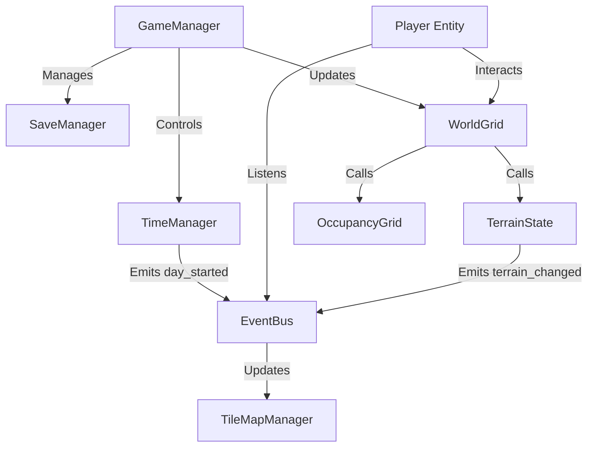
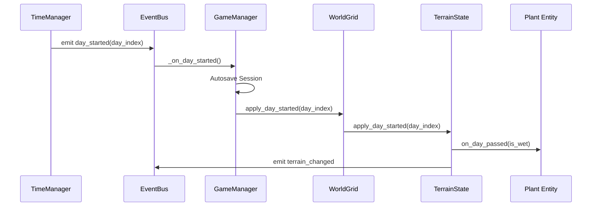
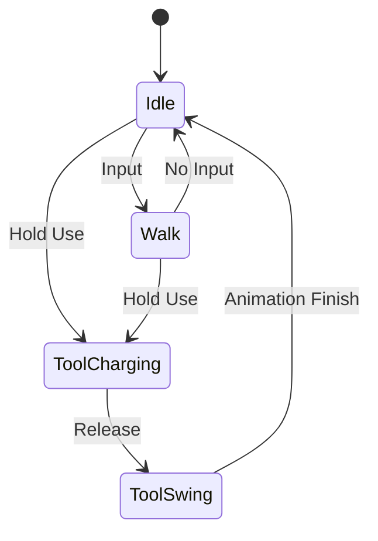

# Architecture Overview

## Introduction
This document provides a high-level overview of the Farming Game architecture. The project is built using Godot 4.5+ and GDScript, leveraging a component-based architecture and robust state management for game entities.

## Core Architecture

The game relies on a set of **Autoloads (Singletons)** to manage global state and facilitate communication between systems.

### Core Singletons
- **GameManager**: The central conductor. Handles session management, level transitions, and "offline" simulation (calculating what happened while the game was closed or a level was unloaded).
- **EventBus**: A centralized signal hub that decouples systems. Entities emit signals here instead of referencing each other directly.
- **TimeManager**: Manages the in-game clock and day/night cycle. Emits `day_started` signals via the EventBus.
- **WorldGrid**: Facade API for gameplay code. Delegates to `TerrainState` + `OccupancyGrid`.
- **TerrainState**: Persisted terrain deltas + simulation driver (emits render events).
- **OccupancyGrid**: Runtime-only occupancy registry (rebuilt from components each load).
- **TileMapManager**: Visual tile rendering (listens to terrain events).
- **SaveManager**: Handles serialization and deserialization of game state.

### System Diagram

## Grid & Farming System

The farming system separates **Data** (TerrainState / OccupancyGrid) from **Presentation** (TileMapManager/Nodes).

### Key Components
- **WorldGrid**: Facade that gameplay code calls (tools, components).
- **TerrainState**: Stores persisted terrain deltas and drives day simulation.
- **OccupancyGrid**: Stores runtime-only occupancy for tool/AI queries.
- **GridCellData**: A data structure holding terrain type, moisture level, and references to entities occupying the cell.
- **GridOccupantComponent**: A component attached to entities (like Plants) that registers them with the `WorldGrid`/`OccupancyGrid` upon creation.
- **SimulationRules**: A helper class containing pure functions for game logic (e.g., `predict_soil_decay`, `predict_plant_growth`).

### Day Cycle Sequence
When a new day starts, the system updates the world state.

## Entity Component System

Entities (Player, NPCs, World Items) are built using composition.

### Common Components
- **StateMachine**: Generic state machine implementation.
- **HealthComponent**: Manages health and death.
- **GridOccupantComponent**: Registers the entity on the grid.
- **RayCellComponent**: Detects the grid cell the entity is facing/aiming at.
- **ShakeComponent**: Handles visual feedback (recoil, damage).

## Player Controller

The Player uses a State Machine to handle actions.

### Player States
- **Idle**: Waiting for input.
- **Walk**: Moving.
- **ToolSwing**: Using a tool (Axe, Pickaxe).
- **ToolCharging**: Charging a tool for a stronger effect.

## Inventory System

The inventory system is data-driven using Resources.

- **InventoryData**: Holds a list of `InventorySlot`s.
- **InventorySlot**: Holds an `ItemData` reference and a count.
- **ItemData**: A `Resource` defining item properties (name, icon, stack limit).
- **ToolData**: Inherits `ItemData`, adds specific tool properties (damage, energy cost).

## Data Persistence (Save System)

The save system uses `ResourceSaver` and `ResourceLoader` with custom `Resource` classes acting as DTOs (Data Transfer Objects).

- **GameSave**: Meta-information (current day, active level).
- **LevelSave**: State of a specific level (grid data, entity positions).
- **SaveComponent**: Attached to entities to automatically serialize their state into the `LevelSave`.

