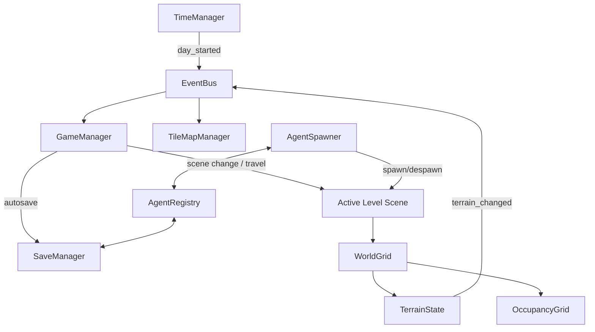
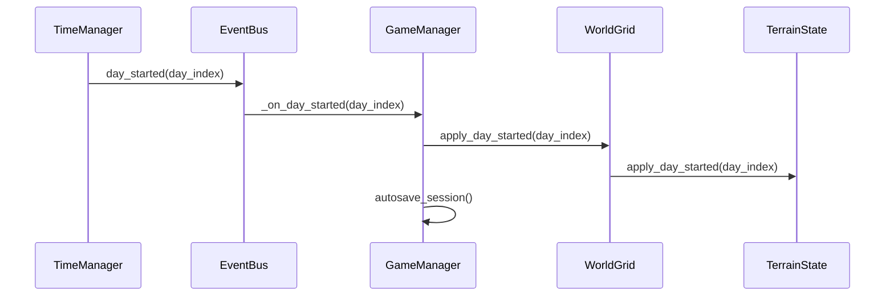

# Architecture Overview

This document is the "hub" for how the project is organized. It’s intentionally high-level; details live in the linked docs below.

## Related docs

- [Grid System](grid_system.md)
- [Save System](save_system.md)
- [Entity Systems](entity_systems.md)
- [AgentRegistry & NPC Simulation](agent_registry_and_npc_simulation.md)

## Core idea

The project relies on a set of **autoloads (singletons)** for global coordination, while gameplay objects are regular scene nodes built from reusable components. The main architectural separations are:

- **Model vs View** for the grid: persisted terrain + runtime occupancy vs tilemap rendering.
- **Runtime Nodes vs persisted records** for agents: nodes exist only in the active scene, but global agent records exist across levels.
- **Capture/Hydration** for saves: serialize runtime state into DTO resources, then reconstruct deterministically when loading.

## Autoloads (singletons)

These are defined in `project.godot` under `[autoload]` (source of truth).

### Gameplay + flow

- **`GameManager`** (`globals/game_manager.gd`): session management, level transitions, autosave, and offline day simulation for unloaded levels.
- **`TimeManager`** (`globals/time_manager.gd`): advances the in-game day and emits `EventBus.day_started`.
- **`EventBus`** (`globals/event_bus.gd`): global signal hub to keep systems decoupled.
- **`SpawnManager`** (`globals/spawn_manager.gd`): spawn markers and placement helpers.

### Grid

- **`WorldGrid`** (`globals/grid/world_grid.gd`): facade API used by gameplay code.
- **`TerrainState`** (`globals/grid/terrain_state.gd`): persisted terrain deltas + day simulation driver.
- **`OccupancyGrid`** (`globals/grid/occupancy_grid.gd`): runtime-only occupancy (rebuilt from components).
- **`TileMapManager`** (`globals/grid/tile_map_manager.gd`): view/render layer for tilemaps.

### Save + agents

- **`SaveManager`** (`save/save_manager.gd`): handles session/slot IO for `GameSave`, `LevelSave`, and `AgentsSave`.
- **`AgentRegistry`** (`globals/agent_registry.gd`): in-memory index of `AgentRecord`s + persistence via `AgentsSave`.
- **`AgentSpawner`** (`globals/agent_spawner.gd`): materializes `AgentRecord`s into runtime nodes for the active level.

### SFX/VFX + debug

- **`SFXManager`** (`globals/sfx_manager.gd`)
- **`VFXManager`** (`globals/vfx_manager.gd`)
- **`DebugGrid`** (`debug/debug_grid.tscn`) and **`GameConsole`** (`debug/game_console.tscn`): debug-only helpers (they auto-disable in non-debug builds).

## High-level runtime flow

## Day tick sequence (today)

On each day tick:

1. `TimeManager.advance_day()` emits `EventBus.day_started(current_day)`.
2. `GameManager` receives the signal, calls `WorldGrid.apply_day_started(day_index)`, then autosaves the session.
3. `GameManager` also runs offline simulation for **unloaded** levels by loading their `LevelSave`, mutating it, and saving it back.

## Entities are composition-first

Entities (player, plants, items, NPCs) are scenes/scripts under `entities/` and use components under `entities/components/`.

- See [Entity Systems](entity_systems.md) for the concrete components and their responsibilities.

## Persistence (conceptual split)

- **Level-owned state**: `LevelSave` for terrain deltas + entity snapshots (things that "belong to a level").
- **Global agent state**: `AgentsSave` for player + NPC records that persist across levels.

See [Save System](save_system.md) and [AgentRegistry & NPC Simulation](agent_registry_and_npc_simulation.md).

