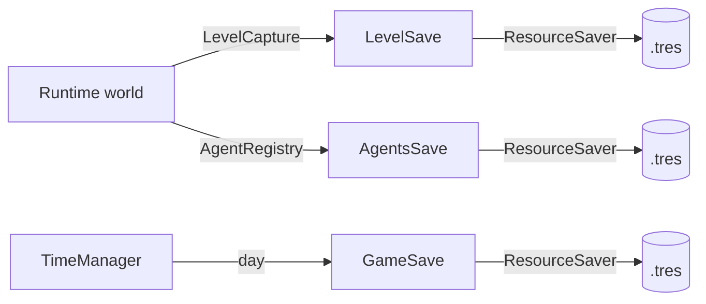

# Save System: Capture & Hydration

This project’s save system is built around two ideas:

- **Capture**: snapshot the runtime world into lightweight DTO `Resource`s.
- **Hydration**: reconstruct a runtime world from those DTOs deterministically.

## Related docs

- [Architecture Overview](architecture.md)
- [AgentRegistry & NPC Simulation](agent_registry_and_npc_simulation.md)
- [Grid System](grid_system.md)

## Session vs slot (disk layout)

The save system distinguishes:

- **Session** (autosave): `user://sessions/current/`
- **Slots** (named saves): `user://saves/<slot>/`

Saving to a slot is implemented by capturing into the session first, then copying the session directory into the slot directory.

### Files you’ll find

- `game.tres`: `GameSave` (current day, active level id)
- `agents.tres`: `AgentsSave` (global `AgentRecord`s for player + NPCs)
- `levels/<level_id>.tres`: `LevelSave` (terrain deltas + entity snapshots for that level)

## What is persisted

### GameSave (global meta)

**Model:** `save/models/game_save.gd`

Stores global session info such as:

- `current_day`
- `minute_of_day`
- `active_level_id`

### LevelSave (per-level state)

**Model:** `save/models/level_save.gd`

Stores data owned by a level:

- terrain deltas (`cells`)
- dynamic + persistent entity snapshots (`entities`)

### AgentsSave (global agents)

**Models:** `save/models/agents_save.gd`, `globals/models/agent_record.gd`

Stores player + NPC records across levels. This is intentionally separate from `LevelSave` so agents can exist “globally” even when their level is unloaded.

## Capture pipeline (runtime → DTO)

### Entry point: autosave

**Code:** `globals/game_manager.gd` (`autosave_session`)

At a high level, autosave does:

1. Capture the active level into a `LevelSave` via `world/capture/level_capture.gd`
2. Save `GameSave` (day + active level id)
3. Capture and save `AgentsSave` via `AgentRegistry` / `AgentSpawner`

### Level capture

**Files:**

- `world/capture/level_capture.gd`
- `world/capture/terrain_capture.gd`
- `world/capture/entity_capture.gd`

The level capture process pulls two data streams:

- **Terrain**: grid deltas owned by `TerrainState`
- **Entities**: saveable scene nodes under the level entity roots

Entity capture details:

- **Deduping**: uses `instance_id` so multi-cell entities (or entities referenced by multiple roots) are captured once.
- **Snapshot**: writes an `EntitySnapshot` with `scene_path`, `grid_pos`, `state`, `persistent_id`.
- **State extraction** (current behavior):
  - If the entity implements `get_save_state()`, use it.
  - Otherwise, fall back to `SaveComponent` if present.

## Hydration pipeline (DTO → runtime)

### Level hydration

**Code:** `world/hydrate/level_hydrator.gd`

When a level scene is loaded, the hydrator:

1. Clears dynamic entities (to avoid double-spawns against the authored scene)
2. Rebuilds terrain deltas into `TerrainState` and the tilemap view
3. Reconciles **persistent entities** (editor-placed) by `persistent_id`
4. Spawns dynamic entities for snapshots that are not reconciled
5. Applies saved state via `apply_save_state(...)` or the entity’s `SaveComponent`

Occupancy is not persisted; it is rebuilt when occupants enter the tree.

### Agent hydration / spawn

After level hydration, `AgentSpawner.sync_all()` ensures:

- the **player** exists and is placed according to the placement policy (record vs spawn marker)
- any **NPC agents** whose `current_level_id == active_level_id` are spawned as nodes and have their record applied

## Offline simulation

**Code:** `world/simulation/offline_simulation.gd` + `world/simulation/rules.gd`

On each day tick, `GameManager` updates **unloaded levels** by:

- loading their `LevelSave`
- applying a day of simulation rules
- saving the mutated `LevelSave` back to disk

## Known constraints / TODOs

- **Hydration is synchronous**: large farms may hitch on load.
  - See `TODO.md`: “Async hydration”.
- **Scene tree is the source of truth for capture**: occupancy is derived and rebuilt from components at runtime.

